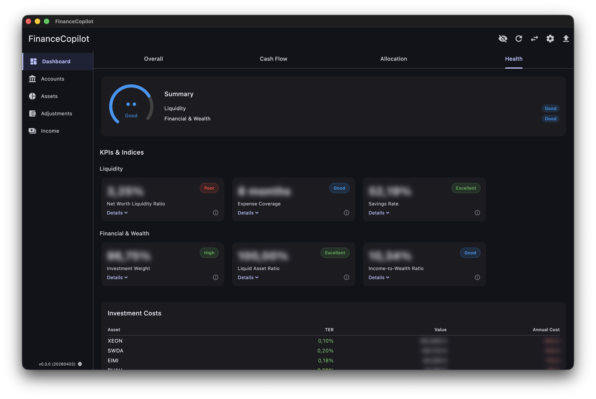
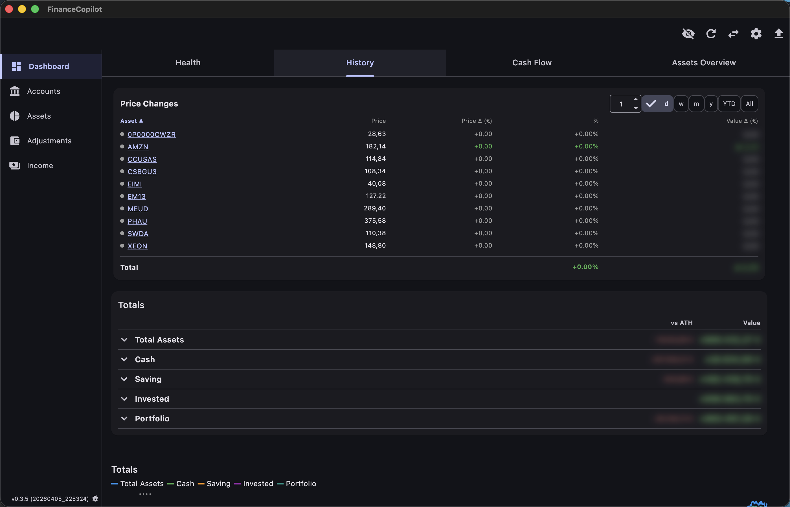
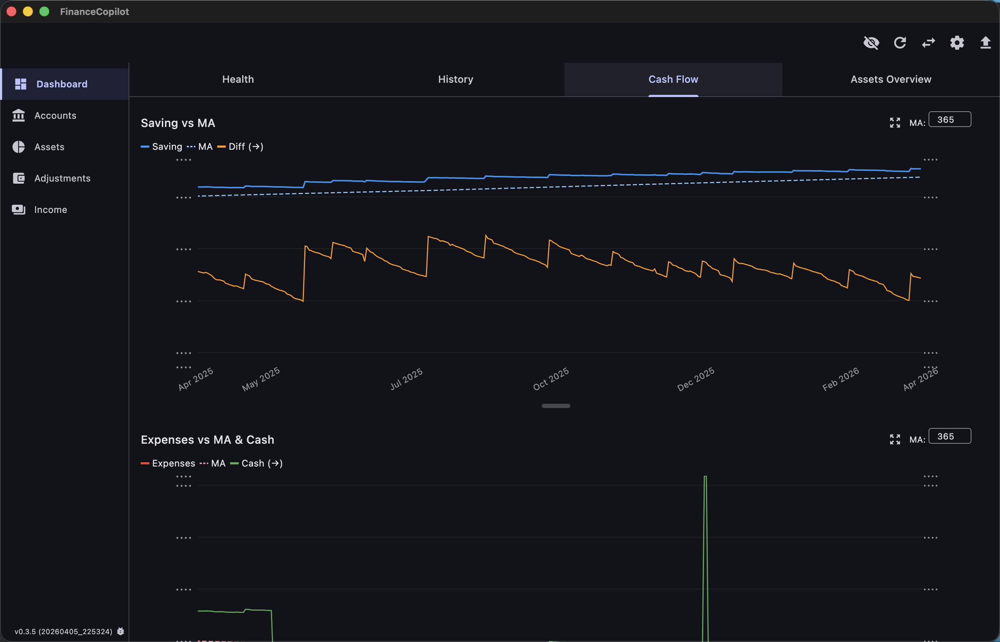
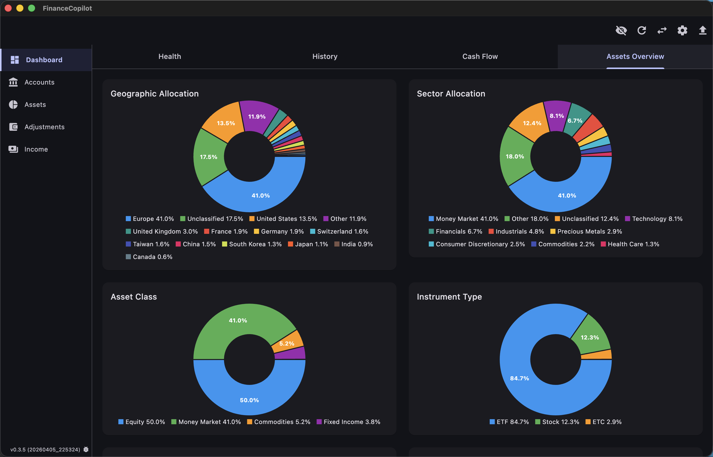
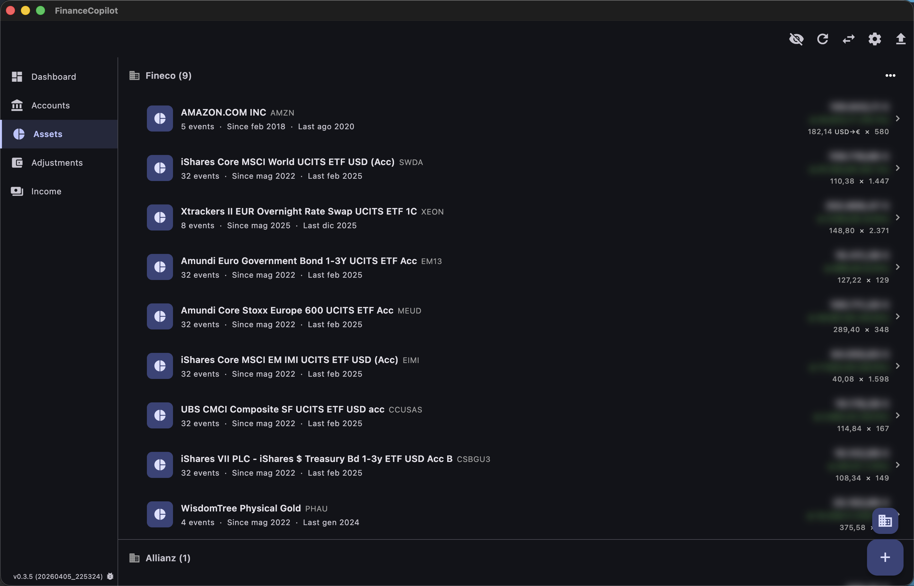
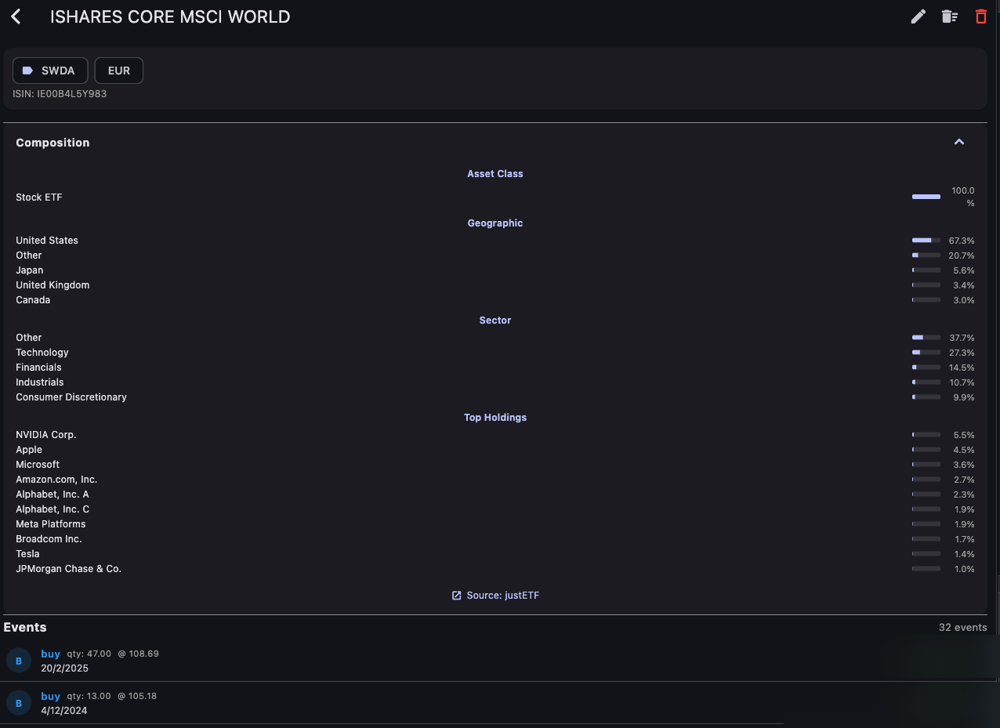
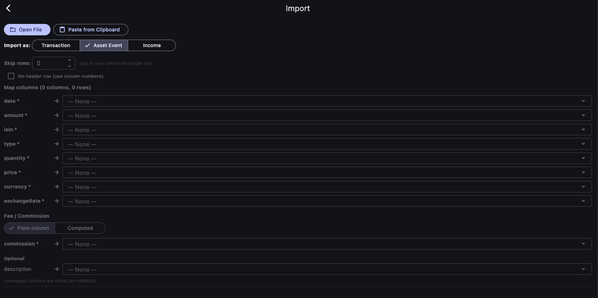

# FinanceCopilot

A personal wealth management app built with Flutter. Track your entire financial picture — bank accounts, investments, ETFs, bonds, commodities, pension funds — in one place with automatic price sync and no cloud dependency.

Runs on **macOS**, **Windows**, and **Android**. All data stays local in SQLite.

## Screenshots

### Financial Health
KPI scoring across Liquidity, Wealth, and Diversification categories with overall health gauge. Each indicator has an info button showing the formula with actual values.



### History & Price Changes
Price changes table with period selector (1D/1W/1M/3M/6M/1Y/YTD/All), combined Totals chart, and drill-down per asset/account.



### Cash Flow
Saving vs moving average with diff overlay, expenses tracking, and YoY comparison charts.



### Portfolio Allocation
Geographic, sector, asset class, and instrument type donut charts. Composition data fetched and aggregated automatically.



### Assets
All your holdings grouped by intermediary, with live prices, event counts, and performance indicators.



### Asset Detail
Per-asset view with ticker, ISIN, exchange, and full event history (buy, sell, revalue). Composition breakdown by geography, sector, and top holdings.



### Import
Flexible column mapping for any bank or broker CSV/Excel export. ISIN-based exchange picker with per-asset exclude checkbox.



## Features

### Net Worth Dashboard
- **Financial Health tab** with KPI scoring: Liquidity (Net Worth Ratio, Expense Coverage, Savings Rate), Wealth (Investment Weight, Liquid Asset Ratio, Income-to-Wealth), Performance & Diversification (Price Changes, HHI, TER)
- **History tab** combining all accounts, assets, and adjustments into one chart
- **Cash Flow tab** with income vs expenses, YoY changes, and EOY prediction
- **Assets Overview** with allocation donuts, top holdings, concentration risk, and investment costs
- **Price Changes table** with 1D/1W/1M/3M/6M/1Y/YTD/All performance per asset
- Toggle privacy mode to blur all amounts

### Portfolio Allocation
- **6 donut charts**: Geographic, Sector, Asset Class, Instrument Type, Currency, Top Holdings
- Drill-down on any slice to see which assets contribute
- **Concentration risk**: Top 1/3/5 percentages and Herfindahl-Hirschman Index (HHI)
- **Investment costs**: Weighted average TER with per-asset cost breakdown
- Composition data auto-fetched for ETFs and stocks

### Asset Tracking
- Stocks, ETFs, ETCs, bonds, pension funds — all in one model
- Buy, sell, and revalue events with full audit trail
- Market prices sync automatically
- **ISIN-first search** — resolves any ISIN to the correct exchange listing
- Bond pricing handles per-nominal quoting (/100)
- Auto-classification by instrument type and asset class
- TER and composition auto-fetched for ETFs

### Account Management
- Unlimited bank accounts, brokers, wallets
- Balances derived from imported transactions — fully auditable history
- Group accounts and assets by **Intermediary** (broker/institution)

### Smart Adjustments
- **Spread Expenses** — Amortise a large purchase over time (e.g. spread a car over 36 months)
- **Donations / Inheritance** — Track and adjust for lump-sum income events

### CSV & Excel Import
- Import from any bank or broker (CSV, XLSX, clipboard)
- Flexible column mapping with saved configs per account
- ISIN-based exchange picker with auto-lookup
- **Exclude checkbox** per ISIN to skip unwanted assets
- Supports: Fineco, Directa, N26, Revolut, Interactive Brokers, and any custom format
- Multi-column amounts, balance-diff mode, formula builder, status filtering
- Import transactions, asset events, or income records
- Correct XLSX numeric parsing (handles 3-decimal values like 260.437)

### Multi-Currency
- 13 currencies: EUR, USD, GBP, CHF, JPY, SEK, NOK, DKK, PLN, CZK, HUF, CAD, AUD
- FX rates synced automatically with historical backfill
- Everything converts to your chosen base currency automatically
- Per-event exchange rate tracking for accurate cost basis

### Income Tracking
- Track income sources with type classification
- Rolling 12-month income for Income-to-Wealth ratio
- YoY income changes with end-of-year prediction
- Monthly expense tracking for health KPI calculations

### Bilingual
- Full Italian and English support (auto-detected from system locale)
- All UI strings, chart labels, KPI descriptions, and ratings localized

## Tech Stack

| Layer | Technology |
|-------|-----------|
| Framework | Flutter / Dart |
| Platforms | macOS, Windows, Android |
| State management | Riverpod (reactive streams) |
| Database | Drift (SQLite) |
| Charts | fl_chart |
| Import | csv, excel, file_picker |

## Install

### Homebrew (macOS)

```bash
brew tap marcobazzani/financecopilot
brew install --cask financecopilot
```

For the nightly build (latest from `develop`):

```bash
brew install --cask financecopilot-nightly
```

### Download

Pre-built binaries for macOS, Windows, and Android are available on the [Releases](https://github.com/marcobazzani/FinanceCopilot/releases) page. The [Nightly Build](https://github.com/marcobazzani/FinanceCopilot/releases/tag/latest) is updated automatically on every push to `develop`.

> **Note:** macOS and Windows binaries are **not code-signed or notarized**. On macOS, you may need to allow the app in **System Settings > Privacy & Security** after the first launch attempt. Homebrew installation will not work on machines with endpoint security software (e.g. CrowdStrike, SentinelOne) that strips unsigned binaries during extraction — use the DMG download directly instead.

### Build from Source

Prerequisites: Flutter SDK ^3.8.1, Xcode (macOS) or Visual Studio (Windows)

```bash
flutter pub get
dart run build_runner build --delete-conflicting-outputs

# macOS
flutter build macos --release
open build/macos/Build/Products/Release/FinanceCopilot.app

# Windows
flutter build windows --release
```

### Run Tests

```bash
# Unit tests (356 tests, ~10s)
flutter test

# Integration tests (29 tests, ~2m, requires macOS)
flutter test integration_test/all_tests.dart -d macos

# Live data test (12 assets, real market data, ~50s)
flutter test integration_test/live_data_fetch_test.dart -d macos
```

## Architecture

- **Offline-first** — All data lives locally in SQLite. Market data and composition are cached after sync.
- **Reactive** — Riverpod stream providers watch the database and rebuild the UI automatically on any change.
- **Self-contained** — The app bundle has no runtime dependencies. No Python, no external processes.
- **ISIN-first** — All asset resolution prefers ISIN over ticker for reliable multi-exchange matching.

## Privacy & Terms

- [Privacy Policy](docs/privacy.md)
- [Terms of Service](docs/terms.md)

## License

MIT
